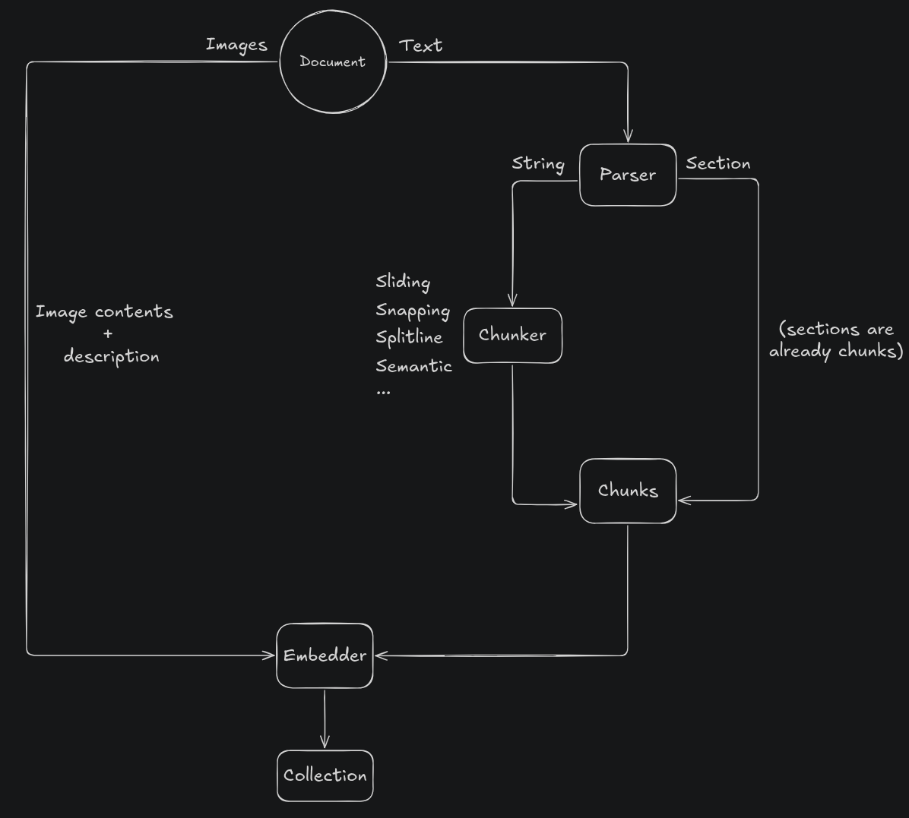

# Chonkit

Chunk documents.

## Contents

- [Using Chonkit](#using-chonkit)
- [Providers](#providers)
- [Binaries](#binaries)
- [Building](#building)
  - [Prerequisites](#prerequisites)
    - [Pdfium](#pdfium)
    - [Fastembed](#fastembed)
    - [CUDA](#cuda)
  - [Features](#features)
  - [Sqlx 'offline' compilation](#sqlx-offline-compilation)
  - [Local quickstart](#local-quickstart)
- [Running](#running)
- [Authorization](#authorization)
- [OpenAPI documentation](#openapi-documentation)
- [License](#license)

## Using Chonkit

Chonkit is an application for chunking and embedding documents
whose chunks can then be used for retrieval augmented generation (RAG).

RAG is a technique to provide LLMs contextual information about arbitrary data.
The jist of RAG is the following:

1. User sends a prompt.
2. Prompt is used for semantic search to retrieve context from the knowledge base.
3. Context and prompt are sent to LLM, providing it the necessary information to
   answer the prompt accurately.

Chonkit focuses on setting up the context and knowledge base from problem 2.



The above image shows the standard procedure of processing a document in chonkit.

To _upload_ a document to Chonkit means to store it on the file system and
create a database entry for it that contains its metadata. The database entry is important as further
processing, namely parsing and chunking, relies on it. The document's images are also extracted and are
stored in an arbitrary BLOB storage.

### Processing text

Once the document is in the system, users can freely experiment with the _parsing_ and _chunking_ configurations
for it. These configurations will determine the final vectors that get generated when _embedding_.

Since no document is the same, they will most likely have different configurations to get the best output.
We want to give LLMs the best possible data when enriching their context, which is why it is very important
that users can experiment with various combinations and choose the right fit, and that the process of
experimenting is fluent.

The _parsing_ configuration will determine which parts of the document to scan.
Parsers are given a **range of elements** to parse in the document, e.g. parse pages 1-5 (when pagination is applicable).

The **element** is document specific. For example, PDF and DOCX define their pages as text elements, while
other document types might define their elements as paragraphs.

A document alongside its default configurations can have a different set of parsing and chunking configuration for each collection.

#### Parsing

The above image shows 2 parsing _modes_; The `String` parsing mode parses all text content in the range
to a single string while the `Section` mode parses multiple ranges into separate sections.

Parsing a whole document to a single string can result in a very big string. With short markdown documents
this might be fine, but if we put 400 whole pages of a PDF into this string, we can't enrich prompts because
we will blast through the context limit. The solution to this is to split this string into smaller pieces,
or in other words, _chonk it_.

#### Chunking

Chunking is really where the fun (or torment) starts. At the time of writing, Chonkit supports the chunkers
in the image above. We're not going to go through the details of each here, the only important part for now
is that each behaves a little differently and is more appropriate for specific document types, e.g. whether
it is used for documentation, prose, spreadsheets, etc.

The gist of "good" chunking is to capture the most context that we want to use when they are
retrieved at inference time and used for enrichment. This can really make a difference in the quality of
responses and getting specific information out of a large document.

Chunkers always output a (rust) vector of multiple string containing the split original document string.

Notice that the output of the `Section` parser does not require additional chunking as the sections already
serve as the chunks.

#### Embedding

Once we have the chunks, an embedding model is used to create vector representations for each chunk.
The embeddings, along with their chunks, are stored in a vector database. The embeddings are used
to locate the original chunks in the database, based on semantic similarity. The chunks stored
alongside the vectors are used to enrich the context.
The embedding model and its provider are defined by the collection the vectors are being stored in.

Once the embeddings are stored, users can use the search routes to experiment with retrieval.

### Processing images

Each time a document is uploaded all of its images are processed in the background and stored on some BLOB
storage provider. Images are processed completely separately from text and must be added to collections
manually because processing images is a bit more complicated.

Images can be embedded in multiple ways, one of which is to use a _multi-modal_ embedding model.
These models capture relationships between text and images and embed them in such a way they land close
to each other in vector space, e.g. the vectors of the text "dog" and those of an image of a dog will be similar.

At the time of writing, the only embedding provider that supports multi-modal models is `vllm`. These models
use a chat template (openai) for embeddings, and when embedding images can only do it one at a time. These chat
templates also support sending text content alongside the image so as to describe it and influence the
resulting embedding.

Users can describe images to play around with the different embeddings and see how they behave using the search
functionality.

When images are embedded and stored in the collection, the associated embedding payload will be the image ID,
image data, and the image description.

### Usage notes

Note that since the embedding model is defined by the collection, every embedding in that collection will use that model.

This also applies to any applications that may use these collections - they have to respect the schema used in payloads
associated with embeddings when retrieving them.

## Providers

Chonkit uses a modular architecture that allows for easy integration of new
vector database, embedding, and document storage providers.
This section lists the available providers and their corresponding feature flags.

### Vector database providers

| Provider | Feature    | Description                                              |
| -------- | ---------- | -------------------------------------------------------- |
| Qdrant   | `qdrant`   | Enable qdrant as one of the vector database providers.   |
| Weaviate | `weaviate` | Enable weaviate as one of the vector database providers. |

#### Required arguments

##### Qdrant

| Arg            | Env          | Default | Description |
| -------------- | ------------ | ------- | ----------- |
| `--qdrant-url` | `QDRANT_URL` | -       | Qdrant URL. |

##### Weaviate

| Arg              | Env            | Default | Description   |
| ---------------- | -------------- | ------- | ------------- |
| `--weaviate-url` | `WEAVIATE_URL` | -       | Weaviate URL. |

### Embedding providers

| Provider     | Feature                  | Description                                                                                                                                                                                                                                                                                                                             |
| ------------ | ------------------------ | --------------------------------------------------------------------------------------------------------------------------------------------------------------------------------------------------------------------------------------------------------------------------------------------------------------------------------------- |
| OpenAI       | `openai`                 | Enable OpenAI as one of the embedding providers.                                                                                                                                                                                                                                                                                        |
| Azure OpenAI | `azure`                  | Enable Azure OpenAI as one of the embedding providers.                                                                                                                                                                                                                                                                                  |
| Fastembed    | `fe-local` / `fe-remote` | Enable Fastembed as one of the embedding providers. The local implementation uses the current machine to embed, the remote implementation uses a remote server and needs a URL to connect to. When running locally the `cuda` feature flag will enable CUDA support and will fallback to the CPU if a CUDA capable device is not found. |
| VLLM         | `vllm`                   | Enable VLLM as one of the embedding providers.                                                                                                                                                                                                                                                                                          |

#### Required arguments

##### OpenAI

| Arg | Env          | Default | Description     |
| --- | ------------ | ------- | --------------- |
| -   | `OPENAI_KEY` | -       | OpenAI API key. |

##### Azure

| Arg                   | Env                 | Default | Description                                                                                                       |
| --------------------- | ------------------- | ------- | ----------------------------------------------------------------------------------------------------------------- |
| -                     | `AZURE_KEY`         | -       | Azure OpenAI API key.                                                                                             |
| `--azure-endpoint`    | `AZURE_ENDPOINT`    | -       | Azure OpenAI endpoint, including the resource, but not the deployment; e.g. `https://<resource>.openai.azure.com` |
| `--azure-api-version` | `AZURE_API_VERSION` | -       | Azure OpenAI API version.                                                                                         |

##### VLLM

| Arg             | Env             | Default | Description    |
| --------------- | --------------- | ------- | -------------- |
| -               | `VLLM_KEY`      | -       | VLLM API key.  |
| --vllm-endpoint | `VLLM_ENDPOINT` | -       | VLLM endpoint. |

##### Remote Fastembed

| Arg            | Env          | Default | Description                                 |
| -------------- | ------------ | ------- | ------------------------------------------- |
| `--fembed-url` | `FEMBED_URL` | -       | The URL to connect to the Fastembed server. |

### Document storage providers

| Provider     | Feature         | Capabilities | Description                                                                               |
| ------------ | --------------- | ------------ | ----------------------------------------------------------------------------------------- |
| Local        | Always enabled. | read/write   | Uses the machine's file system to store documents. Always enabled and cannot be disabled. |
| Google Drive | `gdrive`        | read         | When enabled, allows files to be imported from Google Drive.                              |

#### Required arguments

##### Local

| Arg             | Env           | Default         | Description                        |
| --------------- | ------------- | --------------- | ---------------------------------- |
| `--upload-path` | `UPLOAD_PATH` | `./data/upload` | Where to store uploaded documents. |

##### Google Drive

| Arg                            | Env                          | Default         | Description                                                   |
| ------------------------------ | ---------------------------- | --------------- | ------------------------------------------------------------- |
| `--google-drive-download-path` | `GOOGLE_DRIVE_DOWNLOAD_PATH` | `./data/gdrive` | The directory to download files to when importing from Drive. |

When enabled, allows files to be imported from Google Drive.

Google Drive only accepts tokens generated by OAuth clients,
therefore you need to set one up with a Google project.

To use any of the routes for importing files, an access token from
Google is required.

When accessing any of this provider's routes, the access token must either be
in the `google_drive_access_token` cookie, or in the `X-Google-Drive-Acess-Token`
header.

All files imported from Drive will be downloaded into the directory provided
on application startup (see table below). This means changes from Drive will
not be reflected in Chonkit unless manually refreshed. There is a route that
lists all files imported from Drive and compares the local modification time
with the current modification time of the file. If the external modification time
is newer, the file can be re-downloaded.

## Binaries

This workspace consists the following binaries:

- chonkit; exposes an HTTP API around `chonkit`'s core functionality.
- feserver; used to initiate fastembed with CUDA and expose an HTTP API for embeddings.

## Building

### Prerequisites

#### Pdfium

Chonkit depends on [pdfium_render](https://github.com/ajrcarey/pdfium-render)
to parse PDFs. This library depends on [libpdfium.so](https://github.com/bblanchon/pdfium-binaries).
In order for compilation to succeed, the library must be installed on the system.
To download a version of `libpdfium` compatible with chonkit (6996),
run the following (assuming Linux):

```bash
mkdir pdfium
wget https://github.com/bblanchon/pdfium-binaries/releases/download/chromium%2F6996/pdfium-linux-x64.tgz -O - | tar -xzvf - -C ./pdfium
```

The library can be found in `./pdfium/lib/libpdfium.so`.
In order to let cargo know of its existence, you have 2 options:

- Set the `LD_LIBRARY_PATH` environment variable.

  - By default, the GNU linker is set up to search for libraries in `/usr/lib`.
    If you copy the `libpdfium.so` into one of those directories, you do not
    need to need to set this variable. However, if you want to use the library
    from a different location, you need to tell the linker where it is:

    ```bash
    export LD_LIBRARY_PATH=/path/to/dir/containing/pdfium:$LD_LIBRARY_PATH
    ```

    Note: You need to pass the directory that contains the `libpdfium.so` file,
    not the file itself. This command could also be placed in your `.rc` file.

- Copy the `libpdfium.so` file to `/usr/lib`.

The latter is the preferred option as it is the least involved.

See also: [rpath](https://en.wikipedia.org/wiki/Rpath).

Note: The same procedure is applicable on Mac, only the paths and
actual library files will be different.

#### Fastembed

- Required when compiling with `fe-local`.

Fastembed models require an [onnxruntime](https://github.com/microsoft/onnxruntime).
This library can be downloaded from [here](https://github.com/microsoft/onnxruntime/releases),
or via the system's native package manager.

#### CUDA

- Required when compiling with `fe-local` and `cuda`.

If using the `cuda` feature flag with `fastembed`, the system will need to have
the [CUDA toolkit](https://developer.nvidia.com/cuda-downloads) installed.
Fastembed, and in turn `ort`, will then use the CUDA execution provider for the
onnxruntime. `ort` is designed to fail gracefully if it cannot register CUDA as
one of the execution providers and the CPU provider will be used as fallback.

Additionally, if running `feserver` with Docker, [these instructions](https://docs.nvidia.com/datacenter/cloud-native/container-toolkit/latest/install-guide.html#installation)
need to be followed to enable GPUs in Docker.

### Features

The following is a table of the supported build features.

| Feature     | Configuration      | Description                                                                                         |
| ----------- | ------------------ | --------------------------------------------------------------------------------------------------- |
| `qdrant`    | VectorDb provider  | Enable qdrant as one of the vector database providers.                                              |
| `weaviate`  | VectorDb provider  | Enable weaviate as one of the vector database providers.                                            |
| `fe-local`  | Embedder provider  | Use the implementation of `Embedder` with `LocalFastEmbedder`. Mutually exclusive with `fe-remote`. |
| `fe-remote` | Embedder provider  | Use the implementation of `Embedder` with `RemoteFastEmbedder`. Mutually exclusive with `fe-local`. |
| `openai`    | Embedder provider  | Enable openai as one of the embedding providers.                                                    |
| `azure`     | Embedder provider  | Enable azure as one of the embedding providers.                                                     |
| `vllm`      | Embedder provider  | Enable vllm as one of the embedding providers.                                                      |
| `cuda`      | Execution provider | Available when using `fe-local`. When enabled, uses the CUDAExecutionProvider for the onnxruntime.  |
| `gdrive`    | Storage provider   | Enable Google Drive as one of the document storage providers.                                       |
| `auth-jwt`  | Authorization      | Enable JWT authorization.                                                                           |

### Sqlx 'offline' compilation

By default, Chonkit uses [sqlx](https://github.com/launchbadge/sqlx) with Postgres.
During compilation, sqlx will use the `DATABASE_URL` environment variable to
connect to the database. In order to prevent this default behaviour, run

```bash
cargo sqlx prepare --workspace
```

This will cache the queries needed for 'offline' compilation.
The cached queries are stored in the `.sqlx` directory and are checked
into version control. You can check whether the build works by unsetting
the `DATABASE_URL` environment variable.

```bash
unset DATABASE_URL
```

### Local quickstart

```bash
cp .example.env .env
source setup.sh
```

Creates the 'data/upload' and 'data/gdrive' directories for storing documents.
Starts the infrastructure containers (postgres, qdrant, weaviate).
Exports the necessary environment variables to run chonkit.

## Running

Example command:

```bash
cargo run -p chonkit --no-default-features -F "weaviate openai vllm" -- -l debug,sqlx=off,hyper=info -a 0.0.0.0:42070
```

All CLI arguments have priority over the environment variables.
See [Authorization](#authorization) for more information about authz specific arguments.

Besides the provider arguments, the following arguments are available.

### Logging

| Arg     | Env        | Feature | Default | Description                              |
| ------- | ---------- | ------- | ------- | ---------------------------------------- |
| `--log` | `RUST_LOG` | \*      | `info`  | The `RUST_LOG` env filter string to use. |

See `RUST_LOG` syntax [here](https://rust-lang-nursery.github.io/rust-cookbook/development_tools/debugging/config_log.html#configure-logging).

### Server

| Arg                      | Env                    | Feature | Default         | Description                                         |
| ------------------------ | ---------------------- | ------- | --------------- | --------------------------------------------------- |
| `--address`              | `ADDRESS`              | \*      | `0.0.0.0:42069` | The address (host:port) to bind the server to.      |
| `--cors-allowed-origins` | `CORS_ALLOWED_ORIGINS` | \*      | -               | Comma separated list of origins allowed to connect. |
| `--cors-allowed-headers` | `CORS_ALLOWED_HEADERS` | \*      | -               | Comma separated list of accepted headers.           |
| `--cookie-domain`        | `COOKIE_DOMAIN`        | \*      | `localhost`     | Which domain to set on cookies.                     |

### Infrastructure

| Arg                    | Env                  | Feature | Default | Description                                      |
| ---------------------- | -------------------- | ------- | ------- | ------------------------------------------------ |
| `--db-url`             | `DATABASE_URL`       | \*      | -       | The database URL.                                |
| `--redis-url`          | `REDIS_URL`          | \*      | -       | URL to connect to Redis for the embedding cache. |
| `--redis-embedding-db` | `REDIS_EMBEDDING_DB` | \*      | 0       | The Redis database to use for text embeddings.   |
| `--redis-image-db`     | `REDIS_IMAGE_DB`     | \*      | 1       | The Redis database to use for image embeddings.  |
| `--minio-url`          | `MINIO_URL`          | \*      | -       | The Minio endpoint where image BLOBs are stored. |
| `--minio-bucket`       | `MINIO_BUCKET`       | \*      | -       | The Minio bucket.                                |
| `--minio-access-key`   | `MINIO_ACCESS_KEY`   | \*      | -       | The Minio access key (username).                 |
| `--minio-secret-key`   | `MINIO_SECRET_KEY`   | \*      | -       | The Minio secret key (password).                 |

## Authorization

### JWT authorization

#### Feature

- `auth-jwt`

#### Required args

| Arg               | Env             | Default | Description            |
| ----------------- | --------------- | ------- | ---------------------- |
| `--jwt-issuer`    | `JWT_ISSUER`    | -       | The issuer of the JWT. |
| `--jwks-endpoint` | `JWKS_ENDPOINT` | -       | The JWKs endpoint.     |

#### Description

Chonkit supports standard OAuth 2.0 + OIDC authorization. It uses [jwtk](https://github.com/blckngm/jwtk) to verify tokens with their associated public keys via the
JWKs endpoint.

Along with the signature, the following claims are validated:

- `iss`: Has to be equal to the `JWT_ISSUER` starting argument.
- `entitlements`: Must contain the `admin` application entitlement.
- `groups`: Must contain the `ragu_admins` group.

## OpenAPI documentation

OpenAPI documentation is available at any chonkit instance at `http://your-address/swagger-ui`.

## License

This repository contains Chonkit, a part of Ragu, covered under the [Apache License 2.0](LICENSE), except where noted (any Ragu logos or trademarks are not covered under the Apache License, and should be explicitly noted by a LICENSE file.)

Chonkit, a part of Ragu, is a product produced from this open source software, exclusively by Barrage d.o.o. It is distributed under our commercial terms.

Others are allowed to make their own distribution of the software, but they cannot use any of the Ragu trademarks, cloud services, etc.

We explicitly grant permission for you to make a build that includes our trademarks while developing Ragu itself. You may not publish or share the build, and you may not use that build to run Ragu for any other purpose.
